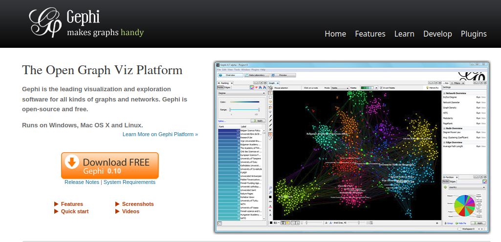
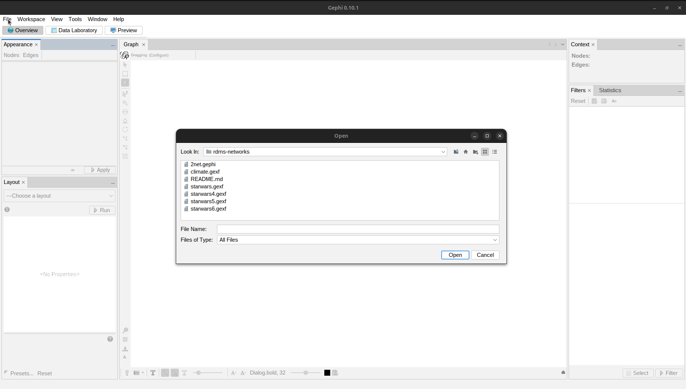
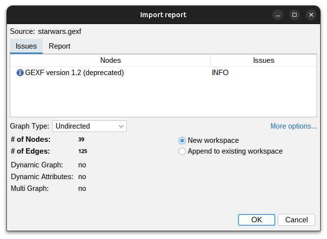
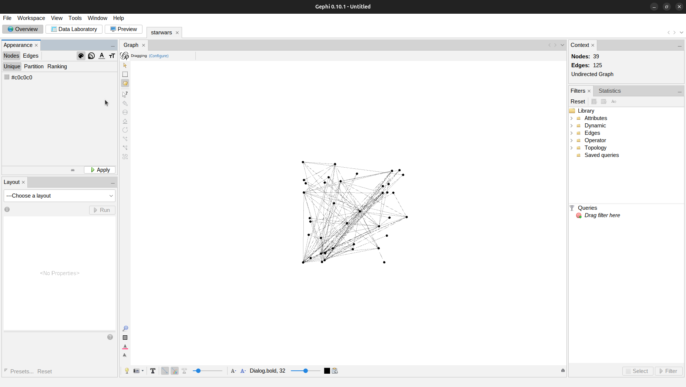
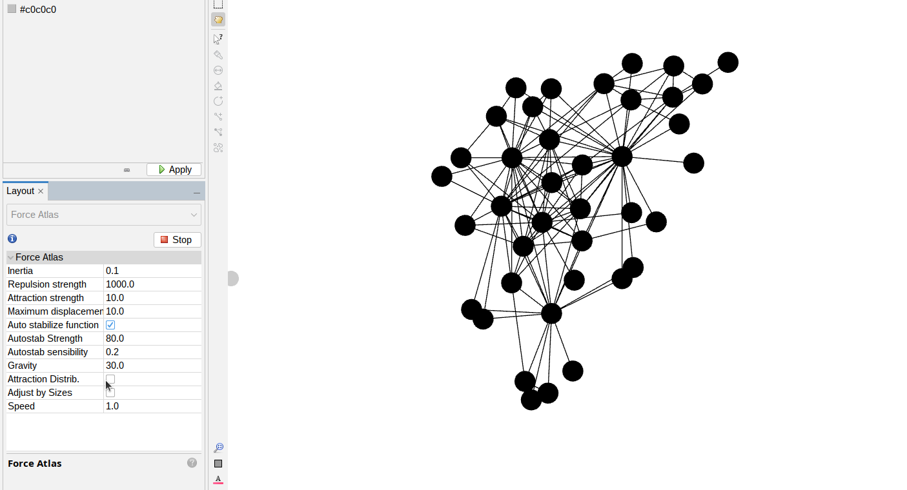
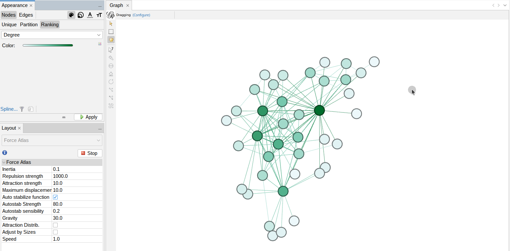
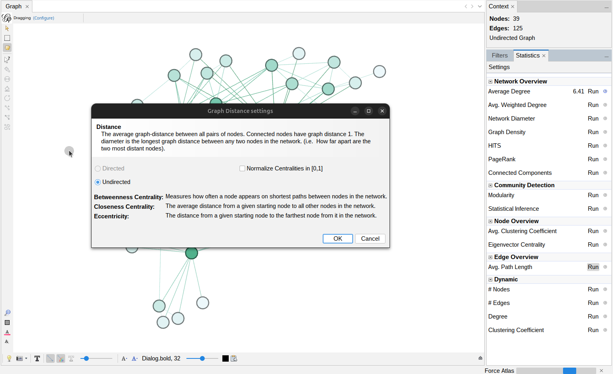
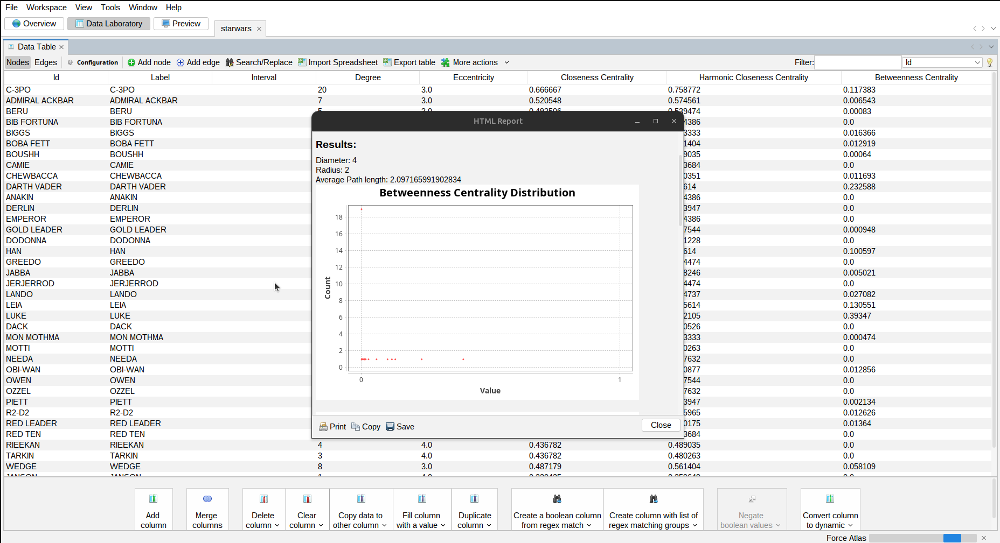
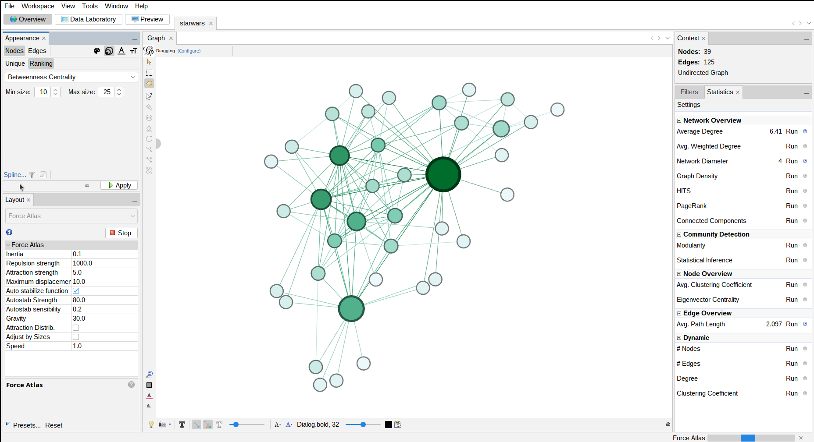
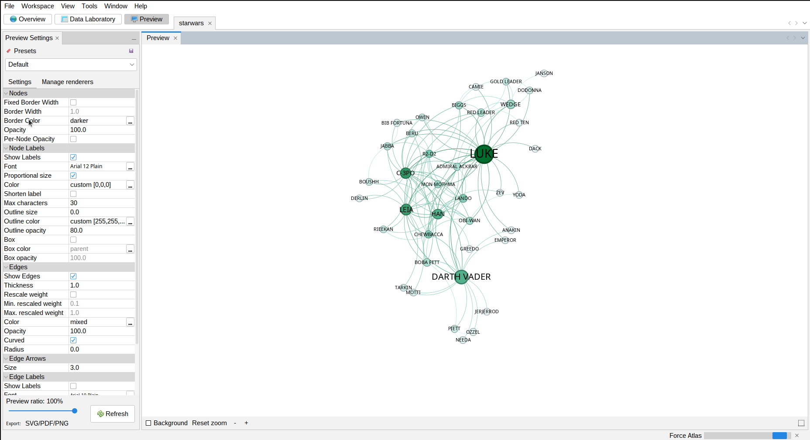

# Network Analysis

This tutorial is the companion for the network analysis chapter (7) of the coursebook Researching Digital Media and Society (Lindgren & Eriksson Krutrök, SAGE, 2024).

1.

First you can get Gephi from [https://gephi.org/users/download/](https://gephi.org/users/download/)

Choose the version for your operating system and follow the instructions on <https://gephi.org/users/install/> 



2.
Next the data can be accessed by cloning the github repo 

```
git clone https://github.com/simonlindgren/rdms-networks where/you/want_it

```
3. 
Now you can launch Gephi. Right click on *File* in the top left corner and select *Open*. A new menu will open that will allow you to navigate to the files we got from github. 



Now we can select the *starwars.gexf* file. A new menu will open up reporting the import details, simply click OK.



4.

The graph will load now, including all the attributes. You can now play around with all the features of Gephi. For even more tutorials check out the official page <https://gephi.org/users/>



This is the first page is mostly to explore the data. The node locations are random, you can zoom in adjust edge size and move nodes by grabbing them, this also highlights connected nodes.

You can on the bottom left play around with different layouts. This is a nice way to explore the structure of the graph.



One can also add different attributes to colour the nodes using the menu above on the left. 



Now we can divert our attention to the other side of the graph. We can select from a range of statistics Gephi can calculate for us. In this case we will select *Avg. Path Length*. This prompts a settings panel, as we have an undirected graph we can just click normalise and OK.



After this we get a report of the metric we just calculated. We can verify and check the results of the metrics by clicking on the *Data Laboratory* tab on the top ribbon. 



Now let us get back to the *Overview* tab and add the newly calculated Betweenness centrality to set the size of the nodes. This we will do by selecting *Nodes* and *Ranking*. Then we can select the concentric circles for setting the size of the nodes, and betweenness centrality from the dropdown. We also need to select the size scale. 



At last we can add some labels by clicking at the bottom under the graph visual. 


Now we can move to the *Preview* tab to see a prettier visualisation and export our work. In order to see the changes we made you need to click the *Refresh* button at the bottom.



These are just some of the things that one can do with Gephi. At the Gephi website you can find more tutorials and materials for your work. <http://www.martingrandjean.ch/gephi-introduction/> 
There are many many more alternatives in the field of network visualisation software and libraries. Some examples you might want to check out are Cytoscape, NetworkX, igraph, or Plotly. 

